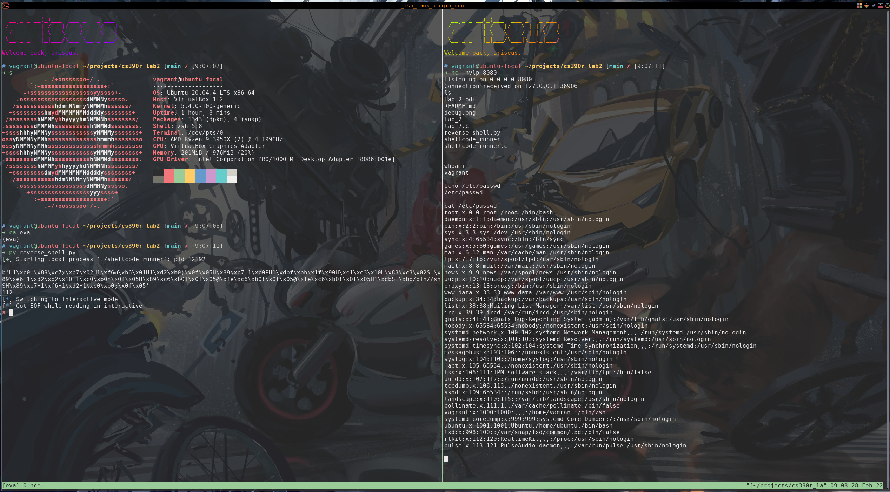

# Reverse Shell x86-64

UMass Amherst 2022 Spring CS390R Lab 2

- [Lab Exercise Instruction](Lab%202.pdf)
- [Solution Article](https://silviavali.github.io/blog/2019-01-25-blog-SLAE2/)

### Special characters eliminated

I improve the shellcode such
that `0x00(NUL), 0x0a(LF), 0x0b(VT), 0x0d(CR), 0xff(EOF)` are eliminated.

## Reverse Shell



1. Compile [`shellcode_runner.c`](shellcode_runner.c), which read the shellcode
   from stdin and execute it.

```bash
gcc shellcode_runner.c -z execstack -o shellcode_runner -g
```

2. Listen from local port

```bash
nc -nvlp 8080
```

3. Spawn reverse shell on target machine

```bash
python3 reverse_shell.py
```

## Environments

- x86-64 Linux (VM recommended)
- `python3` environment with [`pwntools`](https://github.com/Gallopsled/pwntools)
  installed
- `tmux` if the script is running within an ssh session

## Debug


Set `DEBUG = True` to debug the assembly with `gdb`.
